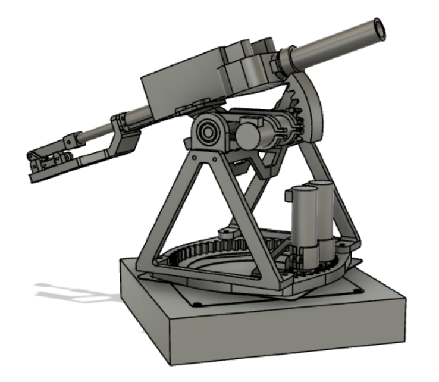

# Lab 0xFF: Term Project Heat Seeking Nerf Turret

### Overview of the Project
In this lab, we use what we learned from the previous labs to create a turreting platform to aim a nerf gun using the 
output of a thermal camera to shoot nerf darts at people. The overall purpose of this is to compete in a classroom 
tournament. The game resembles a western dual where each player stand at the end of the table and each respective turret
is placed on the end of the table. During the first 5 seconds of play, the turret can turn around and aim. At the end of 
5 seconds, a freeze is called and firing can start. For 10 seconds, everyone is frozen and firing can take place.

### Hardware Design

The turret is built on a wooden structure which serves to house the electronics, and elevates the turret about 5 inches. 
A lazy susan bearing is screwed to the wooden structure with an internal gear on the rotating part of the bearing. 
The yaw motor mount is bolted to the wooden structure and holds two motors for rapidly moving the yaw axis. On the 
internal gear is a truss structure, which elevates the pitch control above the yaw motors. A segment of an internal gear
is responsible for moving the pitch axis. For a nerf gun, we bought an aftermarket flywheel and barrel replacement, and 
built our shooting mechanism around it. See the images below for the CAD of the hardware of the turret and the final 
product of the hardware, as well as a video demo on youtube.

[[Term Project Video Demonstration Link]](https://youtube.com/shorts/cGrDZCYPnl0)

### Software Design

For our implementation of the software onboard the nerf turret, the software is centered around the camera. The camera
has several states, which then determine which values to pass to the other tasks using shares for the tasks to determine
simple actions to take, these other tasks like the motor controller tasks and the fire control, need to be run as fast 
as possible to ensure working motion of the turret.

A more detailed explanation and Doxygen documentation of the code can be found [Here](https://peytia.github.io/ME405_Term_Proj/). 

### Discussion of Results

Overall, we produced a final product that successfully tracked people's therman signature using the provided thermal
camera. While a combination of insufficient reliability testing, tuning, and modification and bug exploitation on part
of the opposing team resulted in poor performance in the tournament, the turret ultimately performed its task. Given
more time, a more reliable product could have been made.

Our first tests were done with a soldering iron for creating a pinpoint therman body that was far hotter/brighter than
the surrounding environment. This let us fine tune the tracking of the camera to a specific, defined point within the 
cameras view. Then, we moved onto tracking heat from human bodies, which worked fine. Alot of time was spent refining 
the process in which we pause the motion of the system to take a picture as we were experiencing issues with the motor
tasks putting voltage to the motors while taking a picture, the picture taking WAY too long to take, and drifting while
picture is being taken because the motor tasks are not being called to update themselves. More time would have allowed us
to fully patch this bug, and a further iteration of the motor task to include breaking could be investigated.

### What We Learned

For those who would wish to build upon our work: our final hardware design worked very well. If we had more time to
develop this project, I likely would not change much about hardware. The one thing I would explore would be to place a 
fixed thermal camera halfway across the table. Other teams found alot of success proceeding this way, and we strugged with 
the poor resolution of the thermal camera finely tracking at a distance. Initially we were planning on using hobby servos
to control the pitch of the turret. Upon very early testing, we realized the hobby servos were both too weak and not fine
enough to control the pitch axis, and so we switched to DC motors with an encoder, the same motor as the yaw axis.

Our iteration would take place mostly on the software side. Alot more time needs to be spent finely tuning and fixing bugs
within the software than what one would initially believe. The camera being implamented into the provided MCU took far
too long to take pictures. We would use an ESP32 coded in C++ to process the camera alone, and then make an I2C network 
between the STM32 and the ESP32 to make a more closely real-time updating camera, which the specs advertized and what
another team accomplished. As mentioned earlier, iteration of the motor task with motor breaking would also be useful for 
holding position while taking a picture and shooting.